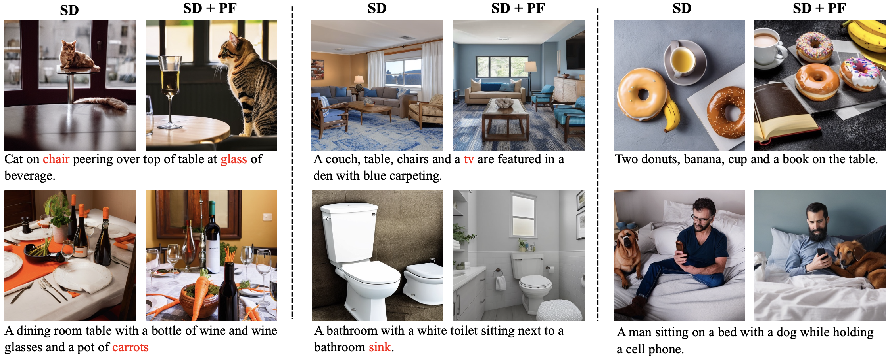

# Correcting Diffusion Generation through Resampling

This is the official impelmenation of the paper "Correcting Diffusion Generation through Resampling".



## Abstract
Despite diffusion models' superior capabilities in modeling complex distributions, there are still non-trivial distributional discrepancies between generated and ground-truth images, which has resulted in several notable problems in image generation, including missing object errors in text-to-image generation and low image quality. Existing methods that attempt to address these problems mostly do not tend to address the fundamental cause behind these problems, which is the distributional discrepancies, and hence achieve sub-optimal results. In this paper, we propose a particle filtering framework that can effectively address both problems by explicitly reducing the distributional discrepancies. Specifically, our method relies on a set of external guidance, including a small set of real images and a pre-trained object detector, to gauge the distribution gap, and then design the resampling weight accordingly to correct the gap. Experiments show that our methods can effectively correct missing object errors and improve image quality in various image generation tasks. Notably, our method outperforms the existing strongest baseline by 5% in object occurrence and 1.0 in FID on MS-COCO.

## Requirements
### Environment
Install conda environment by running
```
conda env create -f environment.yml
conda activate resampling
python -m spacy download en_core_web_sm
```

## Usage
The detailed steps for text-to-image generation and unconditional and class-conditioned generation are in the folder [text_to_image](text_to_image) and [benchmarks](benchmarks) respectively.

## References
If you find our work useful for your research, please consider citing our paper:
```
@misc{liu2023correcting,
      title={Correcting Diffusion Generation through Resampling}, 
      author={Yujian Liu and Yang Zhang and Tommi Jaakkola and Shiyu Chang},
      year={2023},
      eprint={2312.06038},
      archivePrefix={arXiv},
      primaryClass={cs.CV}
}
```

Our implementation is based on following repos:
* https://github.com/NVlabs/edm
* https://github.com/alsdudrla10/DG
* https://github.com/Newbeeer/diffusion_restart_sampling
* https://github.com/openai/guided-diffusion
