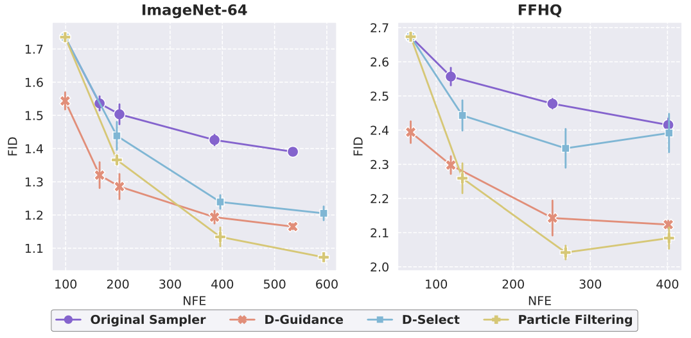

# Experiments on ImageNet-64 and FFHQ
The following figure shows the FID of our method (particle filtering) and baselines on ImageNet-64 and FFHQ using Restart sampler.



Below are the detailed steps to reproduce the results.

## 1) Prepare pre-trained score networks and classifier
  - Run the following script to download pre-trained score networks from [EDM](https://github.com/NVlabs/edm) and classifier from [guided_diffusion](https://github.com/openai/guided-diffusion).
  
  ```
  bash scripts/download.sh
  ``` 

  - The directory should contain the following files.
  ```
  ${project_page}/benchmarks
  ├── checkpoints
  │   ├── pretrained_score/edm-imagenet-64x64-cond-adm.pkl
  │   ├── pretrained_score/edm-ffhq-64x64-uncond-vp.pkl
  │   ├── ADM_classifier/64x64_classifier.pt
  ├── ...
  ```

## 2) Generate samples
### 2.1) Generate samples
  - To generate 50k samples using our particle filtering method with Restart sampler on ImageNet, run: 
  ```
  python3 generate.py --network checkpoints/pretrained_score/edm-imagenet-64x64-cond-adm.pkl \
      --outdir samples/imagenet_restart_pf_4 --sampler restart --method pf --cond 1 \
      --discriminator_ckpt checkpoints/discriminator/discriminator_imagenet.pt \
      --restart_info '18; {"0": [3, 1, 19.35, 40.79], "1": [4, 1, 1.09, 1.92], "2": [4, 4, 0.59, 1.09], "3": [4, 1, 0.30, 0.59], "4": [4, 4, 0.06, 0.30]}' \
      --S_churn 0.0 --S_min 0.01 --S_max 1.0 --S_noise 1.003 --num_particles 4 --seeds 0-199999 \
      --dg_weight_1st_order 0.0 --steps 64 --resample_inds -1
  ```
  
  Some arguments are explained below:
  ```
  --network: path to pre-trained score network
  --outdir: directory to store generated images
  --sampler: which diffusion sampler to use, choose from {restart, edm}
  --method: which method to use for generation
      pf: particle filtering (ours)
      dg: discriminator guidance
      none: original sampler
  --cond: is it class-conditioned generation? 1 for ImageNet and 0 for FFHQ
  --discriminator_ckpt: path to pre-trained discriminator
  --restart_info: configurations for Restart sampler
  --num_particles: number of particles for each generation
  --seeds: random seeds to use for generation. Should contain num_particles * 50k seeds
  --steps: number of denoising steps. Only used for EDM sampler
  --resample_inds: indices to do resampling. Only used for EDM sampler
  --dg_weight_1st_order: discriminator guidance weight. Only used for dg method
   ```
  The `restart_info` is in the format of $N_{\textrm{main}}; \lbrace i: \[N_{\textrm{Restart}, i}, K_i, t_{\textrm{min}, i}, t_{\textrm{max}, i}\]\rbrace_{i=1}^l$. Please refer to Table 8 in the paper for details. Please refer to Table 7 for values of `steps` and `resample_inds`.

  To accelerate generation, `seeds` can be partitioned into multiple chunks and run parallel on multiple GPUs.

### 2.2) Select the best image
  - After generating `num_particles * 50k` images, run the following code to select the best image among `num_particles` particles based on the discriminator.
  ```
  python select_top_k.py --indir samples/imagenet_restart_pf_4 --outdir samples/imagenet_restart_pf_4/best --best_of_n 4


  --indir: directory that stores generated images. This should be outdir in step 2.1
  --outdir: directory to store select images
  --best_of_n: how many images to select from. This should equal num_particles in step 2.1
  ```

### 2.3) Running scripts
  - We provide the scripts to run our method, discriminator select, and discriminator guidance in `scripts/run_pf.sh`, `scripts/run_ds.sh`, and `scripts/run_dg.sh` respectively.
  - For particle filtering, `scripts/run_pf.sh` takes three arguments:
  ```
  $1: dataset name, choose from {imagenet, ffhq}
  $2: diffusion sampler, choose from {restart, edm}
  $3: number of particles
  ```
  - For discriminator select, `scripts/run_ds.sh` takes the same three arguments:
  ```
  $1: dataset name, choose from {imagenet, ffhq}
  $2: diffusion sampler, choose from {restart, edm}
  $3: number of particles
  ```
  - For discriminator guidance, `scripts/run_dg.sh` takes three arguments:
  ```
  $1: dataset name, choose from {imagenet, ffhq}
  $2: diffusion sampler, choose from {restart, edm}
  $3: restart configuration index (for Restart sampler), or number of steps (for EDM sampler)
  ```
  To get the results in the paper, for ImageNet and Restart sampler, use `$3=2,3,4,5,6`, for ImageNet and EDM sampler, use `$3=64,128,256,384`, for FFHQ and Restart sampler, use `$3=0,1,2,3`, for FFHQ and EDM sampler, use `$3=32,64,128,200`. 
  
## 3) Evaluate FID
  - The statistics files from [EDM](https://github.com/NVlabs/edm) are already downloaded in step 1.
  - The directory should contain the following files.
  ```
  ${project_page}/benchmarks
  ├── stats
  │   ├── ffhq-64x64.npz
  │   ├── imagenet-64x64.npz
  ├── ...
  ```
  - To calculate FID, run: 
  ```
  python3 fid_npzs.py --images=samples/imagenet_restart_pf_4/best --ref=stats/imagenet-64x64.npz --num_samples=50000


  --images: directory that stores the selected images from step 2.2
  --ref: reference file, choose from {stats/imagenet-64x64.npz, stats/ffhq-64x64.npz}
  ```
