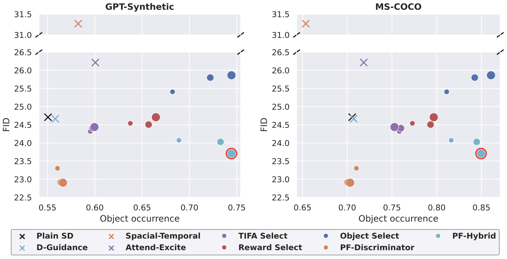

# Experiments for Text-to-image Generation
The following figure shows the FID and object occurrence of our method (PF) and baselines using Restart sampler.



Below are the detailed steps to reproduce the results.

## 1) Preparation
  - Run the following script to download pre-trained discriminators, input text prompts, and pre-computed statistics.
  ```
  bash scripts/download.sh
  ```

## 2) Generate samples
### 2.1) Generate samples
  - To generate images using our particle filtering method with Restart sampler, run:
  ```
  python generate.py --prompt_file data/coco_object.json --method pf-hybrid --sampler restart \
      --diffusion_model_id stabilityai/stable-diffusion-2-1-base --num_generation 10 --batch_size 10 \
      --restart_info_ind 0 --figure_dir figures/coco_object_restart_pf-hybrid_10 --seed 0
  ```
  
  Some arguments are explained below:
  ```
  --prompt_file: file that stores the input text prompts. Choose from {data/coco_object.json, data/gpt_synthetic.json, data/coco_5000.json}
  --method: which method to use for generation
      pf-hybrid: particle filtering with hybrid approach (default)
      pf-discriminator: particle filtering with only discriminator
      none: original sampler
  --sampler: which diffusion sampler to use, choose from {restart, edm}
  --diffusion_model_id: model name on diffusers. Currently support v2.1-base and v1.x
  --num_generation: number of particles for each text prompt
  --batch_size: how many images to generate together for each text prompt. Default to num_generation, reduce if out of memory
  --restart_info_ind: configuration index for Restart sampler. Should be 0 (first line in restart_params.txt)
  --figure_dir: directory to store generated images
  --num_step: number of denoising steps in generation. Only used for EDM sampler
  --resample_inds: time steps to do resampling. Only used for EDM sampler
   ```

  To accelerate generation, `--prompt_start` and `--prompt_end` can be used to partition the `prompt_file` into multiple chunks and run parallel on multiple GPUs.

### 2.2) Select the best image
  - After generating candidates, run the following code to select the best image among `num_generation` particles.
  ```
  python select_best.py --prompt_file data/coco_object.json --sampler restart --method pf-hybrid \
      --diffusion_model_id stabilityai/stable-diffusion-2-1-base --num_generation 10 \
      --input_figure_dir figures/coco_object_restart_pf-hybrid_10 --output_figure_dir figures/coco_object_restart_pf-hybrid_10_out
  ```
  Most of the arguments are the same with step 2.1, except:
  ```
  --input_figure_dir: directory that stores generated images. This should be figure_dir in step 2.1
  --output_figure_dir: directory to store select images
  ```

### 2.3) Running scripts
  - We provide the script to run our method and ObjectSelect in `scripts/run.sh`.
  - It takes four arguments:
  ```
  $1: dataset name, choose from {coco_object, gpt_synthetic, coco_5000}
  $2: diffusion sampler, choose from {restart, edm}
  $3: generation method, choose from {pf-hybrid, pf-discriminator, none}. none corresponds to ObjectSelect
  $4: number of particles
  ```
  Note: when `$3` is `none`, generated images from step 2.2 can also be used for TIFASelect and RewardSelect. Please refer to the original repos for the calculation of these selection criteria. For convenience, we also provide the questions generated by GPT-3.5 for TIFASelect in `data`.

## 3) Calculate object occurrence
  - To calculate object occurrence on `coco_object` and `gpt_synthetic`, run the following code:
  ```
  python test_object_occurrence.py --prompt_file data/coco_object.json --figure_dir figures/coco_object_restart_pf-hybrid_10_out
  ```
  where `figure_dir` should be the `output_figure_dir` in step 2.2, which contains selected images. The object occurrence is evaluated using an object detector different from the one used in generation.

## 4) Evaluate FID
  - To calculate FID on `coco_5000`, run the following code:
  ```
  python fid.py calc --images=figures/coco_5000_restart_final_out/ --ref=stats/coco_5000_stats.npz --num 5000
  ```
  where `--images` should be the `output_figure_dir` in step 2.2, which contains selected images, and `stats/coco_5000_stats.npz` contains the pre-computed statistics for reference images.
